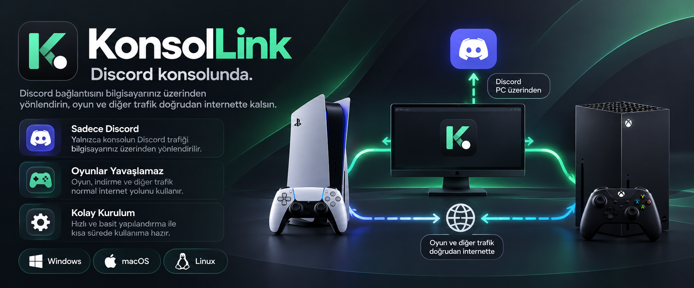
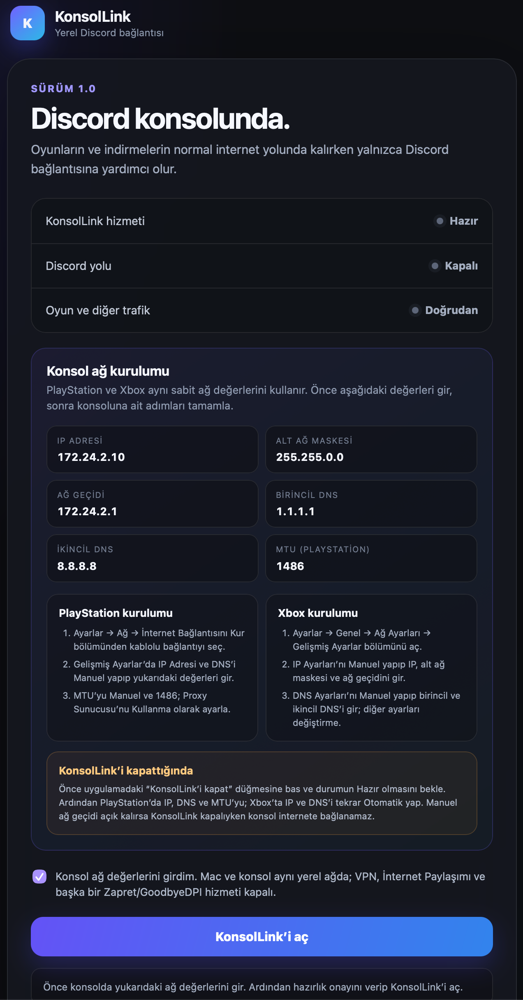
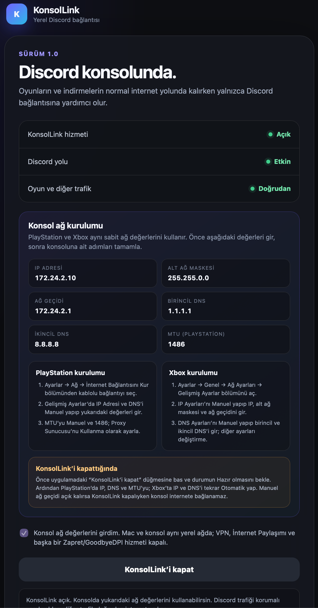

# KonsolLink

   

**Türkiye’deki konsol kullanıcıları için yerel Discord bağlantısı.**

KonsolLink, PlayStation ve Xbox’ın yerleşik Discord özelliğine ait bağlantıları
aynı yerel ağdaki Mac üzerinden geçirir. Oyun, mağaza, indirme ve diğer konsol
trafiği normal internet yolunda kalır. Uzak VPN, üyelik hesabı veya KonsolLink
sunucusu kullanılmaz.

<p align="center">
  
</p>

> [!IMPORTANT]
> Şu anda yayıma hazır ve fiziksel olarak doğrulanmış sürümler **Apple Silicon macOS** ve **Windows x64** sürümleridir.
> KonsolLink, Türk Telekom bağlantısında PlayStation 5 ve Xbox Series X/S ile fiziksel olarak test edilmiştir.
> Lünux uygulaması henüz kullanıma hazır değildir.

## Uygulama görünümü

<p align="center">
  
  
</p>

## Platform durumu

| Platform | Durum | Açıklama |
|---|---|---|
| macOS / Apple Silicon | Kullanılabilir | Türk Telekom ve PlayStation 5, Xbox Series X/S üzerinde fiziksel olarak çalıştığı doğrulandı. |
| Windows x64 | Kullanılabilir | Türk Telekom ve PlayStation 5, Xbox Series X/S üzerinde fiziksel olarak çalıştığı doğrulandı. |
| Linux x64 | Hazır değil | Kod ve servis altyapısı mevcut; gerçek Linux/konsol kabul testi tamamlanmadı. |

Bu tablo yeni fiziksel testler tamamlandıkça güncellenecektir. “Hazır değil”
durumundaki platformlarda kurulum paketi yayımlanması veya çalışacağına dair
garanti verilmesi amaçlanmaz.

## Gereksinimler

### macOS

- Apple Silicon işlemcili bir Mac
- Türk Telekom internet bağlantısı
- Aynı modem/yerel ağa bağlı Mac ve PlayStation 5 veya Xbox Series X/S
- Mac’in çalışan internet bağlantısı (Wi-Fi kullanılabilir)
- Konsolun modeme Ethernet veya aynı yerel ağ üzerinden bağlantısı
- Mac’te VPN, İnternet Paylaşımı ve başka Zapret/GoodbyeDPI hizmetlerinin kapalı olması

### Windows

- x64 tabanlı Windows bilgisayar
- Npcap (WinPcap API-compatible Mode etkin)
- Türk Telekom internet bağlantısı
- Aynı modem/yerel ağa bağlı Windows bilgisayar ve PlayStation 5 veya Xbox Series X/S
- Bilgisayarın çalışan internet bağlantısı
- Konsolun modeme Ethernet veya aynı yerel ağ üzerinden bağlantısı
- VPN, İnternet Paylaşımı ve başka DPI araçlarının kapalı olması

Konsol ile bilgisayarın birbirine doğrudan Ethernet kablosuyla bağlanması gerekmez.
İkisinin aynı yerel ağda bulunması yeterlidir.

### 1. Uygulamayı kur

#### macOS

1. Yayımlanan macOS DMG dosyasını aç.
2. İçindeki kurulum paketine sağ tıklayıp **Aç** seçeneğini kullan.
3. macOS’un istediği yönetici parolasını gir ve kurulumu tamamla.
4. Uygulamalar klasöründen **KonsolLink**’i aç.

İmzasız geliştirme paketlerinde macOS ek güvenlik uyarısı gösterebilir. Yalnızca
bu deponun Releases bölümünden veya kendiniz derlediğiniz paketi kullanın.

#### Windows

1. [Npcap](https://npcap.com/) kurulu değilse resmi kaynaktan indirip kur.
2. Npcap kurulumunda **WinPcap API-compatible Mode** seçeneğinin etkin olduğundan emin ol.
3. KonsolLink’in Windows x64 kurulum dosyasını Releases bölümünden indir.
4. Kurulum dosyasını çalıştır ve kurulumu tamamla.
5. Başlat menüsünden **KonsolLink**’i aç.

> [!NOTE]
> Windows sürümü şu anda dijital olarak imzalanmamıştır. Bu nedenle Windows
> SmartScreen kurulum sırasında **Unknown publisher** veya benzeri bir güvenlik
> uyarısı gösterebilir. KonsolLink’i yalnızca bu deponun resmi Releases
> bölümünden indirin ve gerekirse yayımlanan SHA-256 özetiyle dosyayı doğrulayın.

### 2. Konsol ağını ayarla

Konsolda **Ayarlar → Ağ → Ayarlar → İnternet Bağlantısını Kur** yolunu
izleyip bağlantıyı manuel olarak düzenleyin:

| Ayar | Değer |
|---|---|
| IP adresi | `172.24.2.10` |
| Alt ağ maskesi | `255.255.0.0` |
| Varsayılan ağ geçidi | `172.24.2.1` |
| Birincil DNS | `1.1.1.1` |
| İkincil DNS | `8.8.8.8` |
| MTU | Manuel, `1486` |
| Proxy sunucusu | **Kullanma** |

### 3. KonsolLink’i aç

1. Uygulamadaki hazırlık kutusunu işaretle.
2. **KonsolLink’i aç** düğmesine bas.
3. Üç durum göstergesinin sırasıyla **Açık**, **Etkin** ve **Doğrudan** olmasını bekle.
4. Konsolun internet bağlantısını ve ardından Discord’u aç.

KonsolLink etkin olmadan yukarıdaki manuel ağ ayarlarıyla konsolun internete
çıkamaması beklenen davranıştır; KonsolLink’in çalıştığı bilgisayar bu
yapılandırmada konsolun yerel ağ geçididir.

macOS üzerinde etkin oturum boyunca sistemin boşta uyuması uygulama tarafından
engellenir; ekran kapanabilir ve pencere arka planda kalabilir. Pencerenin kapatma
düğmesi uygulamayı menü çubuğuna gizler. Menüdeki **Çıkış** uygulamayı ve oturumu
sonlandırır. Kapak kapatılması, elle uykuya geçirme veya ağın kesilmesi bu
korumanın kapsamına girmez.

### 4. Kullanmayı bıraktığında

1. Önce uygulamada **KonsolLink’i kapat** düğmesine bas.
2. Durumun **Hazır** olmasını bekle.
3. PlayStation’da IP, DNS ve MTU ayarlarını yeniden **Otomatik** yap.

Manuel ağ geçidi ayarını açık bırakırsanız KonsolLink kapalıyken konsol internete
bağlanamaz. KonsolLink’in çalıştığı bilgisayarı kapatmadan veya ağdan ayırmadan önce de
aynı işlemi uygulayın.

## Nasıl çalışır?

```text
Konsol
      |
      v
Bilgisayar üzerindeki yerel KonsolLink ağ geçidi
      |
      +-- Discord bağlantıları --> yerel DPI uyumluluk yolu --> internet
      |
      `-- Oyun / PSN / indirme --> doğrudan internet
```

KonsolLink konsola `172.24.2.1` adresinde yerel bir ağ geçidi sunar. Discord’a
ait alan adları kapalı bir izin listesiyle sınıflandırılır. Yalnızca gerekli
Discord TCP bağlantıları bilgisayar üzerindeki yerel DPI uyumluluk motorundan
geçer; oyun ve diğer trafik bu motora yönlendirilmez. DNS çözümleme de yerel ağ
geçidi tarafından yapılır.

- Uzak VPN veya genel amaçlı proxy yoktur.
- Discord hesabı/parolası istenmez ve saklanmaz.
- Telemetri ve kullanıcı etkinliği kaydı yoktur.
- Paket içeriği veya gezinme geçmişi kaydedilmez.
- Geçici ağ kuralları yalnızca etkin oturum süresince kullanılır ve kapanışta geri alınır.
- Başka cihazların trafiğini izlemek ya da genel erişim engeli aşma hizmeti sunmak amaçlanmaz.

Daha ayrıntılı teknik tasarım için [mimari belgesine](docs/ARCHITECTURE.md),
güvenlik sınırları için [güvenlik belgesine](docs/SECURITY.md) bakabilirsiniz.

## Bilinen sınırlar

- Destek şu an Türkiye ve Türk Telekom odaklıdır; farklı ISS’lerde çalışma garantisi yoktur.
- Linux uygulaması yayıma hazır değildir.
- Modem ağı `172.24.0.0/16` aralığını kullanıyorsa adres çakışması yaşanabilir.
- VPN, İnternet Paylaşımı veya başka DPI araçları aynı anda çalışırsa başlatma engellenebilir.
- ISS veya Discord altyapısındaki değişiklikler mevcut profilin güncellenmesini gerektirebilir.

## Sorun bildirimi ve güvenlik

Hata bildirirken işletim sistemi sürümünü, bilgisayar modelini veya temel donanım
bilgilerini, konsol modelini, ISS’yi ve uygulamadaki hata metnini ekleyin.
Discord kullanıcı adı, parola, token, tam paket yakalama veya kişisel ağ
bilgilerini herkese açık bir issue içinde paylaşmayın. Güvenlik açıkları için
[SECURITY.md](SECURITY.md) yönergelerini izleyin.

## Geliştirme

Proje Rust ve Tauri 2 kullanır. Katkıda bulunmadan önce
[CONTRIBUTING.md](CONTRIBUTING.md) dosyasını okuyun. Linux kodunun depoda
bulunması bu platformun desteklendiği anlamına gelmez. Fiziksel kabul matrisi
tamamlanmadan Linux kararlı sürüm olarak işaretlenmemelidir.

Temel geliştirme kontrolleri:

```bash
cargo fmt --all --check
cargo clippy --workspace --all-targets --locked -- -D warnings
cargo test --workspace --locked
npm --prefix apps/desktop ci
npm --prefix apps/desktop run build
```

Üçüncü taraf ağ motorları ve lisansları için
[THIRD_PARTY_NOTICES.md](THIRD_PARTY_NOTICES.md) dosyasına bakın.

## Lisans

KonsolLink’e ait özgün kaynak kod **GNU General Public License v3.0 only
(GPL-3.0-only)** koşullarıyla yayımlanır. Kullanabilir, inceleyebilir,
değiştirebilir ve dağıtabilirsiniz; dağıttığınız türev çalışmalarda ilgili
kaynak kodu aynı lisansla sunmanız gerekir. Kapalı kaynak türev dağıtımına izin
verilmez. Ticari kullanım GPL koşullarına uyulduğu sürece yasak değildir.

Üçüncü taraf bileşenler kendi lisansları altında kalır. Ayrıntılar [LICENSE](LICENSE)
ve [THIRD_PARTY_NOTICES.md](THIRD_PARTY_NOTICES.md) dosyalarındadır.

## Yasal not

KonsolLink Discord, Sony, PlayStation, Microsoft, Xbox veya Türk Telekom ile
bağlantılı ya da bu kuruluşlar tarafından onaylanmış değildir. Ürün ve marka
adları ilgili sahiplerine aittir. Yazılım garanti verilmeden sunulur; kullanımın
yerel mevzuata ve hizmet koşullarına uygunluğunu değerlendirmek kullanıcıya aittir.
